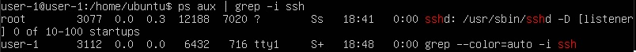

[[#Part 1. Установка ОС|Part 1. Установка ОС]]
[[#Part 2. Создание пользователя|Part 2. Создание пользователя]]
[[## Part 3. Настройка сети ОС|Part 3. Настройка сети ОС]]
[[#Part 4. Обновление ОС |Part 4. Обновление ОС ]]
[[#Part 5. Использование команды **sudo|Part 5. Использование команды sudo]]
[[#Part 6. Установка и настройка службы времени|Part 6. Установка и настройка службы времени]]
[[#Part 7. Установка и использование текстовых редакторов|Part 7. Установка и использование текстовых редакторов]]
[[#Part 8. Установка и базовая настройка сервиса **SSHD**|Part 8. Установка и базовая настройка сервиса SSHD]]
[[#Part 9. Установка и использование утилит **top**, **htop**|Part 9. Установка и использование утилит top, htop]]
[[#Part 10. Использование утилиты **fdisk**|Part 10. Использование утилиты fdisk]]
[[#Part 11. Использование утилиты **df|Part 11. Использование утилиты df]]
[[#Part 12. Использование утилиты **du**|Part 12. Использование утилиты du]]
[[#Part 13. Установка и использование утилиты **ncdu**|Part 13. Установка и использование утилиты ncdu]]
[[#Part 14. Работа с системными журналами|Part 14. Работа с системными журналами]]
[[#Part 15. Использование планировщика заданий **CRON**|Part 15. Использование планировщика заданий CRON]]

---
## Part 1. Установка ОС

*  ``Смотрим версию Ubuntu после установки``

---
## Part 2. Создание пользователя
* ``Создание пользователь и добавление в группу``

* ``Проверка файла passwd``

---
## Part 3. Настройка сети ОС
* ``Зададим название машины``

* ``Меняем тайм зону``

* ``Установим net-tools``
* ``sudo apt install net-tools``
* ``Выведем информацию о сетевых интерфейсах``

- **lo (loopback device)** – виртуальный интерфейс, присутствующий по умолчанию в любом Linux. Он используется для отладки сетевых программ и запуска серверных приложений на локальной машине. С этим интерфейсом всегда связан адрес 127.0.0.1.
* ``Получили ip от DHCP сервера``

* ``DHCP (Dynamic Host Configuration Protocol) - это протокол сетевого уровня, который позволяет устройствам автоматически получать IP-адрес, подсеть, шлюз по умолчанию и другие сетевые настройки от специального сервера, известного как DHCP-сервер.``
* ``Выводим внешний IP-адрес``

* ``Выводим внутренний IP-адрес``

* ``Меняем настройки сети вимом: sudo vim /etc/netplan/00-installer-config.yaml``

* ``Сохраняем изменения, перезагружаем машину``

* ``Пингуем хост 1.1.1.1``

* ``Пингуем хост ya.ru``

---
## Part 4. Обновление ОС 
* ``Обновляем пакеты до новой версии``

* ``Проверяем, что все обновлено``

---
## Part 5. Использование команды **sudo**
* ``sudo (Superuser Do) - это команда в Unix-подобных операционных системах, таких как Ubuntu, предназначенная для выполнения команд с привилегиями суперпользователя (root) или другого пользователя с административными правами. Это позволяет пользователям выполнять задачи, которые требуют повышенных привилегий, без необходимости постоянного входа в систему как суперпользователь.``
* ``Выдаем права sudo второму пользователю``

* ``Выдаем новое имя нашему хосту``

---
## Part 6. Установка и настройка службы времени
* Выведем время часового пояса с **NTPSynchronized=yes**

---
## Part 7. Установка и использование текстовых редакторов
* ``Откроем редактор VIM, заполним файл и сохраним его``

* ``Для выхода с сохранением изменений нужно нажать `ESC`, затем написать `:wq`, что означает write and quit.``
* ``Откроем редактор NANO, заполним файл и сохраним его``

* Для выхода с сохранением изменений нужно нажать `Ctrl+S` и затем `Ctrl+X`.
* ``Откроем редактор MCEDIT, заполним файл и сохраним его``

* Для выхода с сохранением изменений нужно нажать `F10` и выбрать `Yes`
* ``Поменяем в VIM файл на фразу 21 School 21``

* ``Поменяем в NANO файл на фразу 21 School 21``

* ``Поменяем в MCEDIT файл на фразу 21 School 21``

* ``Проверим, что ничего не поменялось``

* ``Отредактируем снова файл и сделаем поиск в VIM ESC + /<слово_для_поиска>``

*  ``Сделаем замену :s/<заменяемое>/<заменитель>``

* ``Отредактируем снова файл и сделаем поиск в NANO Ctrl + W``

* ``Сделаем замену Ctrl + \``

*  ``Выберем на что будем менять``

* ``Просмотрим результат замены``

* ``Отредактируем снова файл и сделаем поиск в MCEDIT F7``

* ``Сделаем замену F4``

* ``Просмотрим результат замены``

---
## Part 8. Установка и базовая настройка сервиса **SSHD**
* Установим службу SSHd с помощью команды: `sudo apt install openssh-server`
* Узнаем состояние SSHd службы, воспользовавшись командой: `sudo systemctl status ssh`

* Как видно на скриншоте, автостарт SSHd службы добавлен автоматически при загрузке. Чтобы включить автостарт можно воспользоваться командой `sudo systemctl enable ssh`, для выключения автостарта команда `sudo systemctl disable ssh`.
* Для перенастройки службы SSHd на порт 2022 откроем файл `sshd_config` с помощью команды `sudo nano /etc/ssh/sshd_config`

* `Перезапустим службу sudo systemctl restart ssh `
* `Проверим состояние SSHd службы после изменения порта командой sudo systemctl status ssh`

* `Настроим брандмауэр так, чтобы можно было использовать ssh, так как мы поменяли порт`

* `Просмотрим процесс sshd через команду ps`

 * ***ps** - утилита для просмотра списка процессов в Linux.  Параметр `-a` - выбрать все процессы всех пользователей, кроме фоновых. Параметр `-u` обозначает ориентированный на пользователя формат, который предоставляет подробную информацию о процессах. Параметр `-x` указывает `ps` перечислить процессы без управляющего терминала. В основном это процессы, которые запускаются во время загрузки и работают в фоновом режиме. `grep -i ssh` - выводит только те строчки, где есть ssh с игнорированием регистра за счет `-i`. Символ `|` перенаправляет вывод команды `ps aux` на ввод `grep -i ssh`.
 * `Выполним перезагрузку машины командой `reboot` и выполним команду netstat -tan`

- `netstat -tan` Команда `netstat` показывает статистику приема и отправки пакетов, а также информацию об ошибках приема и отправки. `-a` - Вывод всех активных подключений TCP и прослушиваемых компьютером портов TCP и UDP. `-n` - Вывод активных подключений TCP с отображением адресов и номеров портов в числовом формате без попыток определения имен. Тогда, если `netstat -na` - просмотр всех открытых протоколов, то `netstat -tan` - просмотр всех открытых ТСР-протоколов. При вызове команды в терминал выводится таблица, столбцы которой имеют следующие значения:  
- а) `Proto` - сетевой протокол (tcp, udp); 
- б) `Recv-Q` - количество байтов, помещённых в буфер приёма TCP/IP, но не переданных приложению. Если это число высокое, то нужно проверить работоспособность приложения, которое работает с данным портом.  
- в) `Send-Q` — количество байтов, помещённых в буфер отправки TCP/IP, но не отправленных, или отправленных, но не подтверждённых. Высокое значение может быть связано с перегрузкой сети сервера.  
- г) `Local Address` — локальный адрес сервера. В обычных соединениях, это адрес сервера на который пришло соединение. В прослушиваемых портах (LISTEN) — это диапазон адресов. Так 0.0.0.0:port — значит подключаться можно ко всем адресам сервера, а 192.168.0.5:port — значит подключаться можно только к этому адресу сервера. 
- д) `Foreign Address` — адрес второй стороны. В обычных соединениях, это адрес с которого пришло соединение. В прослушиваемых портах (LISTEN) — это диапазон адресов. Так 0.0.0.0:* — значит подключаться можно с любых адресов и с любых портов, а например 192.168.0.6:* — значит подключаться можно только с этого адреса и с любых портов.  
- е) `State` — состояние подключения, или прослушивания.
## Part 9. Установка и использование утилит **top**, **htop**
* `Выведем информацию с помощью команды top`

* `uptime - 12 минут;`
* `количество авторизованных пользователей - 1;`
* `общую загрузку системы - 0.00;`
* `общее количество процессов - 122;`
* `загрузку cpu - 0.0%;`
* `загрузку памяти - 167.2 из 1970.9;`
* `pid процесса занимающего больше всего памяти - 1;`
* `pid процесса, занимающего больше всего процессорного времени - 139 и 29;`
---
* `Выведем информацию с помощью команды htop`

- Для сортировки в `htop` нужно нажать `F6` и выбрать параметр сортировки. Отсортируем по `PID`

* Отсортируем по `PERCENT_CPU`

* Отсортируем по `PERCENT_MEM`

* Отсортируем по `TIME`

- Для использования фильтров в `htop` нужно нажать `F4` и выбрать параметр фильтрации. htop, отфильтрованный для процесса SSHd

- Для использования поиска в `htop` нужно нажать `F3` и ввести объект поиска. `htop` с процессом `syslog`, найденным, используя поиск

- Для добавления отображения дополнительных параметров в `htop`, необходимо нажать `F2` и добавить требуемые параметры. `htop` с добавленным выводом hostname, clock и uptime

---
## Part 10. Использование утилиты **fdisk**
* `Запустим команду fdisk -l`

- Название жесткого диска: VBOX HARDDISK (/dev/sda);
- Размер диска: 20 Гигабайт;
- Количество секторов: 41943040;
- `Узнаем размер swap`

* swap - 1966076 килобайт
---
## Part 11. Использование утилиты **df**
* `Используем команду df для просмотра информации`

* `Для корневого раздела (/):`
- Размер раздела: 10218772;  
- Размер занятого пространства: 4665140;  
- Размер свободного пространства: 5012960;  
- Процент использования: 49 %;  
* `Единицы измерения при выводе: Килобайты.`
* `Используем команду df -Th для просмотра информации`

* `Для корневого раздела (/):
- Размер раздела: 9.8;  
- Размер занятого пространства: 4.5;  
- Размер свободного пространства: 4.8;  
- Процент использования: 49 %;  
* `Единицы измерения при выводе: Гигабайты.`
* `Тип файловой системы: Ext4 - журналируемая файловая система, используемая в ОС на ядре Linux. Основана на файловой системе Ext3, но отличается тем, что в ней представлен механизм записи файлов в непрерывные участки блоков (екстенты), уменьшающий фрагментацию и повышающий производительность. В ней есть журналирование, то есть в ней предусмотрена запись некоторых данных, позволяющих восстановить файловую систему при сбоях в работе компьютера.`
---
## Part 12. Использование утилиты **du**
---
* `Используем команду du`

* `Выведем информацию по папке /home в двух видах`

* `Выведем информацию по папке /var в двух видах`

* `Выведем информацию по папке /var/log в двух видах`

* `Выведем информацию по папке /var/log в двух видах(не общее, а каждого вложенного элемента, используя *)`

## Part 13. Установка и использование утилиты **ncdu**
* `Установим ncdu`

* `Выведем информацию с помощью команды ncdu по папке /home`

* `Выведем информацию с помощью команды ncdu по папке /var`

* `Выведем информацию с помощью команды ncdu по папке /var/log`

---
## Part 14. Работа с системными журналами
* `Просмотрим файл /var/log/dmesg`

* `Просмотрим файл /var/log/syslog

* `Просмотрим файл /var/log/auth.log`

* `Просмотрим данные по последней авторизации`

- Время последней успешной авторизации: jul 5, 20:46:54
- Имя пользователя: ubuntu
- Метод входа в систему: by uid = 0 (User Identifier). Суперпользователь всегда должен иметь UID, равный нулю (0).
- `Перезапустим службу SSHd с помощью команды sudo systemctl restart ssh`
* `В журнале найдем сообщение о перезапуске службы`

---
## Part 15. Использование планировщика заданий **CRON**
* `Запустим команду `uptime` через каждые 2 минуты. Для этого откроем планировщик заданий `CRON` в текстовом редакторе `nano` с помощью команды`

* `Найдем в системных файлах информацию об выполнении uptime`

* `Выведем на экран список текущих заданий для CRON`

* `Удалим все задания из планировщика CRON и просмотрим список`

---